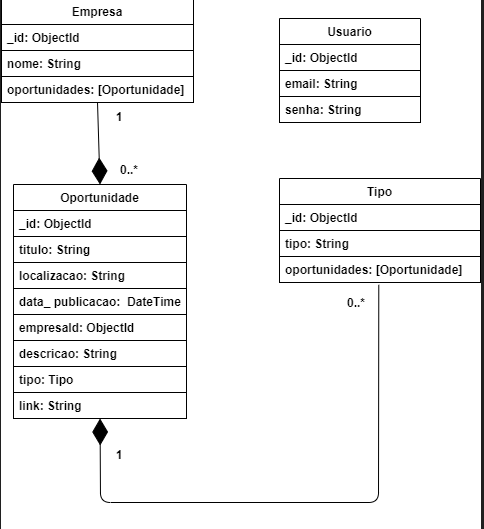

# DSM-P3-G08-2025-2
Repositório do GRUPO 08 do Projeto Interdisciplinar do 3º semestre DSM 2025/2. Aluno: Arthur Rodrigues Ferreira

📌 Projeto: Sistema de Gestão de Oportunidades

Este projeto tem como objetivo desenvolver um back-end completo para gerenciamento de oportunidades de emprego. O sistema permite o cadastro de empresas, tipos de oportunidades, usuários e oportunidades em si, seguindo um modelo de dados organizado e preparado para armazenamento em bancos NoSQL (como MongoDB) ou até mesmo SQL.

🏗️ Modelo Conceitual (DER)

O sistema foi modelado com base no seguinte diagrama:

📎 Diagrama enviado pelo usuário
(Disponível na pasta do projeto)

Entidades principais:
1. Empresa

_id: ObjectId

name: String

oportunidades: [Oportunidade]

Cada Empresa pode publicar várias oportunidades (relação 1:N).

2. Oportunidade

_id: ObjectId

titulo: String

localizacao: String

data_publicacao: DateTime

empresaId: ObjectId (referência para Empresa)

descricao: String

tipo: Tipo

link: String

A Oportunidade pertence a uma única Empresa e possui um Tipo (relação N:1 para cada lado).

3. Tipo

_id: ObjectId

tipo: String

oportunidades: [Oportunidade]

Representa a categoria da oportunidade (ex.: Estágio, CLT, Freelancer).
Uma categoria pode estar associada a várias oportunidades (1:N).

4. Usuário

_id: ObjectId

email: String

senha: String

Usuários podem acessar o sistema para visualizar ou gerenciar oportunidades.
No diagrama atual, o Usuário não possui relação direta com as outras entidades.

🧩 Relacionamentos
Relacionamento	Descrição
Empresa 1 --- 0..* Oportunidade	Uma empresa pode ter várias oportunidades.
Tipo 1 --- 0..* Oportunidade	Um tipo pode ser usado por várias oportunidades.
Oportunidade — Empresa/Tipo	Cada oportunidade pertence a uma única empresa e um único tipo.
🗄️ Estratégia de Banco (MongoDB)

Caso o banco utilizado seja MongoDB, o modelo pode ser estruturado com referências (ObjectId) da seguinte forma:

Collection: empresas
{
  "_id": "ObjectId",
  "name": "Empresa XPTO"
}

Collection: tipos
{
  "_id": "ObjectId",
  "tipo": "Estágio"
}

Collection: oportunidades
{
  "_id": "ObjectId",
  "titulo": "Desenvolvedor Node.js",
  "localizacao": "São Paulo - SP",
  "data_publicacao": "2025-01-02T12:00:00Z",
  "empresaId": "ObjectId",
  "descricao": "Vaga para desenvolvedor backend...",
  "tipoId": "ObjectId",
  "link": "https://exemplo.com/vaga-123"
}

Collection: usuarios
{
  "_id": "ObjectId",
  "email": "teste@email.com",
  "senha": "hash"
}

💻 Funcionalidades esperadas

CRUD de Empresas

CRUD de Tipos

CRUD de Oportunidades

Cadastro e login de Usuários

Relacionamentos entre coleções usando ObjectId

Filtros: por empresa, tipo ou data de publicação

🚀 Tecnologias sugeridas para implementação

Node.js

Express

MongoDB / Mongoose

JWT (para autenticação)

Bcrypt (para hashing de senhas)

Dotenv (para variáveis de ambiente)

📚 Status Atual do Projeto

Modelo conceitual definido

Diagrama criado

Estrutura pronta para implementação do banco de dados

Aguardando desenvolvimento das rotas e controllers

👨‍🏫 Observações para o Professor

Este README acompanha o diagrama enviado e demonstra o entendimento completo do modelo de dados. O projeto foi organizado com foco em:

Clareza dos relacionamentos

Simplicidade e escalabilidade

Aderência a boas práticas de modelagem

Segue abaixo foto do meu diagrama:

